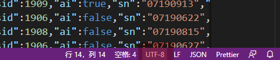
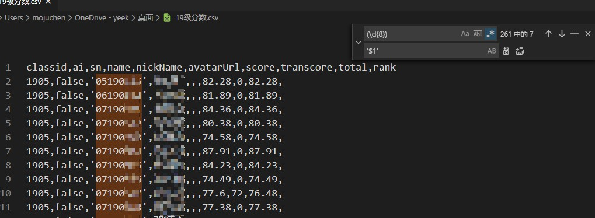

# 18-选专业方向小程序

## 名字乱码(1次)

**问题描述：**

Windows 系统从xls导出到csv再导入到数据库时会出现编码问题

**问题原因：**

Windows 系统的 Excel 导出时使用的是 GB2312 编码，开发者工具导入时使用的是 UTF-8 编码，会导致中文乱码

**解决办法：**

导出后的 csv 文件使用 Vscode 选择 GB2312 编码打开，再使用 UTF-8 保存后导入到数据库即可

 <small> 在vscode的右下角点击编码可以进行选择 / 保存  </small>

## 不想装 sublime

vscode也是支持正则表达式替换的

