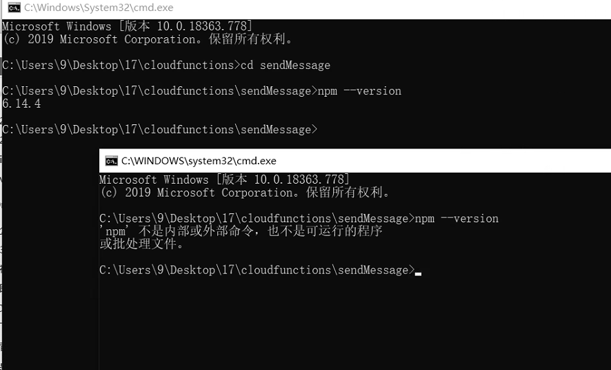

# 综合性坑

## 开发者工具

### npm 不是内部或外部命令 （4次）

**原因**

稳定版开发者工具的bug。

**从开发者工具中右键打开终端是无法找到 npm 指令的**

如下图，上面是在资源管理器中打开的终端可以执行npm指令，下面的找不到

**解决办法**

更新稳定版的开发者工具可能可以解决，不过使用开发版的我从来没有遇到过（一劳永逸）
右键选择打开文件夹，然后从资源管理器里打开cmd（临时解决）